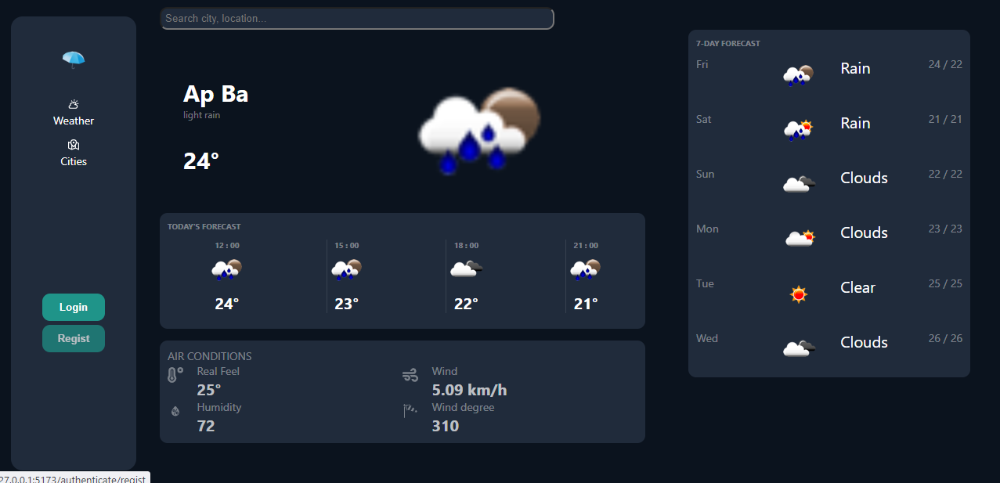
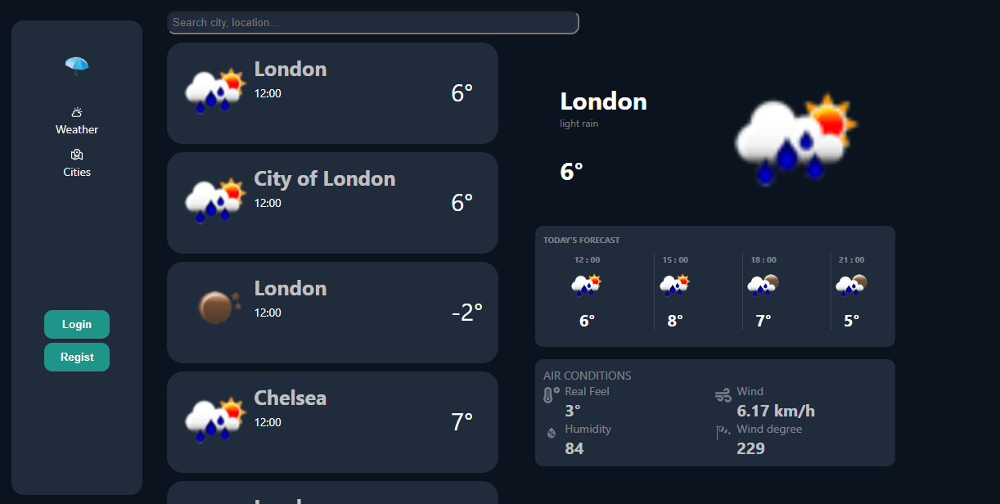
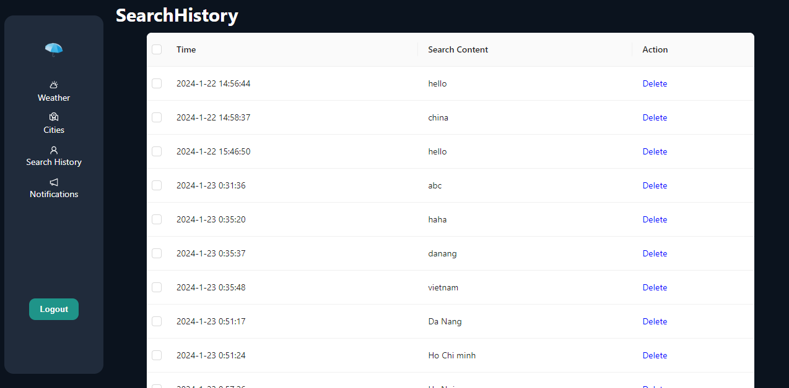

## Chạy backend

- Cài đặt composer:
  Download trực tiếp từ trang chính: https://getcomposer.org/download/ và thực hiện cài đặt

- Cài đặt Laravel:
  composer global require laravel/installer

- Cài đặt Xampp:

Bước 1: Download XAMPP https://www.apachefriends.org/download.html
Bước 2: Nhấp vào file có đuôi .exe trên file tải xuống.
Bước 3: Trên cửa sổ Set up, tích chọn các phần mềm mà bạn muốn cài đặt. Nếu bạn muốn cài WordPress trên XAMPP, các phần mềm bắt buộc phải chọn là MySQL, Apache, PHPMyAdmin. Sau khi chọn xong, nhấn Next.
Bước 4: Chọn thư mục cài đặt và nhấn Next.
Bước 5: Chờ vài phút để cài đặt, sau khi cài đặt hoàn tất nhấn finish để kết thúc.

- Thực hiện thay đổi file config/database.php theo như database trong XAMPP

- Chạy server bằng lệnh : php artisan serve

## Chạy front end:

- Cài đặt nodejs https://nodejs.org/en/

- chạy lệnh: npm install
  để cài đặt các thư viện còn thiếu

- Chạy front end bằng lệnh : npm run dev

# Description of project:

Giao diện

Nếu không đăng nhập thì chỉ có 2 chức năng là xem dự báo thời tiết của nơi ở hiện tại, bao gồm: dự báo thời tiết trong ngày và dự báo thời tiết trong tuần và chức năng tìm kiếm thành phố(để xem dự báo thời tiết của thành phố đó)

Chức năng thứ 2 có thể sử dụng là tìm kiếm, nhập tên thành phố và enter sẽ đưa ra kết quả tìm kiếm, nhấn vào thành phố cụ thể sẽ có thể coi được dự báo thời tiết của thành phố đó. Nếu copy url của 1 người khác thì ta có thể xem được kết quả search của người đó

Chức năng đăng nhập

Chức năng đăng kí

Khi đăng kí xong tài khoản và đăng nhập thành công, sẽ có thêm 2 chức năng khác đó là quản lí lịch sử tìm kiếm và cài đặt thông báo nổi

Chức năng quản lí lịch sử

user có thể xem lịch sử đã tìm kiếm và có thể thực hiện xóa lịch sử tìm kiếm
